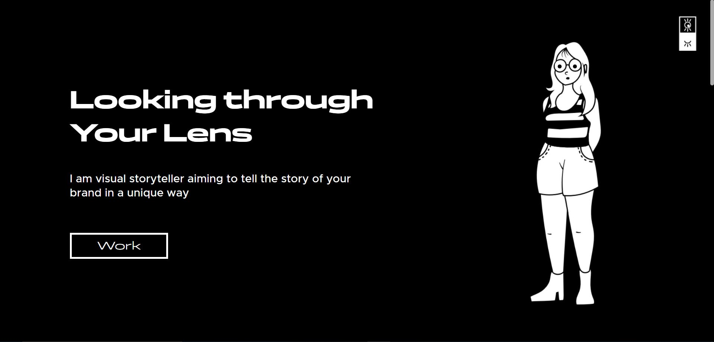

# Rishika Portfolio Website

Server-side Repository is present at <a href="https://github.com/mr-kingshuk/rishi-portfolio-server" target="_blank" rel="noopener noreferrer">rishi-portfolio-server</a> 



## Table of Contents
1. [Introduction](#introduction)
2. [Running Loaclly](#running-locally)
3. [Dependencies](#dependencies)
4. [Environment Variables](#environment-variables)
5. [Pages](#pages)
    - [User Pages](#user-pages)
    - [Login Page and Reset Password Page](#login-page-and-reset-password-page)
    - [All Projects Admin side page](#all-projects-admin-side-page)
    - [Add and Update Projects Admin side page](#add-and-update-projects-admin-side-page)
6. [Contributing](#contributing)    
7. [License](#license)

## Introduction

[Rishika Garg](#https://www.linkedin.com/in/rishisdesign/), a **3rd-year Communication Design student from Nirma University**, approached me to develop her portfolio website, which she had carefully designed herself. She provided a detailed brief outlining the specific **animations and interactions** she wanted to showcase her work creatively. I accepted this challenge and built a **responsive website** that brought her vision to life, incorporating **seamless animations** and optimizing the **user experience across all devices**.The platform includes:

- <ins>**Advanced Content Management System (CMS)**</ins> with a modern drag-and-drop interface, enabling easy addition and update of projects by the client.
- <ins>**Optimized media uploads to Firebase Storage**</ins>, with strict file type and size restrictions for efficient storage management and reduced upload times.
- <ins>**Smooth image rendering through lazy loading**</ins>, implemented via the Blurhash library to enhance user experience.
- <ins>**Unique animations and user experience**</ins>, powered by the FramerMotion library, which contributed to the client's success in securing internships at leading design firms.
- <ins>**Responsive design**</ins>, ensuring a seamless experience across devices, whether on desktop, tablet, or mobile.
- <ins>**Secure login and password reset functionality**</ins>, ensuring client access and management.
- </ins>**Routing using React Router DOM**</ins>, allowing for efficient navigation between pages.

## Running Locally

To set up the project locally, follow these steps:

1. **Clone the repositories**:
   - For the server: 
     ```
     git clone https://github.com/mr-kingshuk/rishi-portfolio-server.git
     ```
   - For the client: 
     ```
     git clone https://github.com/mr-kingshuk/rishi-portfolio-client.git
     ```

2. **Fill the `.env` file**: 
   - Use the `template.env` file as a reference to configure your environment variables.

3. **Set up the database connection in server**:
   - Add the database connection string of MongoDB from the MongoDB Atlas.

4. **Install dependencies and run the server and client**:
   - Navigate to the server folder:
     ```bash
     cd rishi-portfolio-server
     npm install
     npm run dev
     ```
   - Then, navigate to the client folder:
     ```bash
     cd ../rishi-portfolio-client
     npm install
     npm run dev
     ```

5. **Add Admin User**:
   - Alternatively, call the POST endpoint to add admin withe request body having the `email` and the `password`:
     ```
     POST http://localhost:3000/api/users/signup
     ```

## Dependencies

```json
  "dependencies": {
    "axios": "^1.6.8",
    "blurhash": "^2.0.5",
    "firebase": "^10.9.0",
    "framer-motion": "^10.18.0",
    "react": "^18.2.0",
    "react-animate-height": "^3.2.3",
    "react-beautiful-dnd": "^13.1.1",
    "react-blurhash": "^0.3.0",
    "react-dom": "^18.2.0",
    "react-router-dom": "^6.21.1",
    "uuid": "^9.0.1"
  },
  "devDependencies": {
    "@types/react": "^18.2.43",
    "@types/react-dom": "^18.2.17",
    "@vitejs/plugin-react": "^4.2.1",
    "eslint": "^8.55.0",
    "eslint-plugin-react": "^7.33.2",
    "eslint-plugin-react-hooks": "^4.6.0",
    "eslint-plugin-react-refresh": "^0.4.5",
    "vite": "^5.0.8"
  }
```
## Environment Variables

To run this project, you will need to add the following environment variables to your `.env` file:

- `VITE_API_KEY`: Your Firebase API key.
- `VITE_AUTH_DOMAIN`: Your Firebase Auth domain.
- `VITE_PROJECT_ID`: Your Firebase project ID.
- `VITE_STORAGE_BUCKET`: Your Firebase storage bucket.
- `VITE_MESSAGING_SENDER_ID`: Your Firebase messaging sender ID.
- `VITE_APP_ID`: Your Firebase app ID.
- `VITE_MEASUREMENT_ID`: Your Firebase measurement ID.
- `VITE_API_BASE_URL`: The base URL of the server where the backend is hosted.

### Pages

## User Pages

### **Note:** The following video contains *audio commentary* explaining the features and functionality. Please unmute the video for a complete understanding.

https://github.com/user-attachments/assets/1bdd69e1-55ac-4b03-a468-b0b26c7397f7

> *This video provides an overview of the HomePage, which is organized into four sections: the Hero Section, the About Section, the Works Section, and the Contact Section. From the Works Section, users are redirected to the Works Page, where they can access individual project details.*

## Login Page and Reset Password Page

### **Note:** The following video contains *audio commentary* explaining the features and functionality. Please unmute the video for a complete understanding.

https://github.com/user-attachments/assets/e0cb3b83-0916-46c6-afa3-c2846c7c5027

> *This video illustrates the Login Page and all its error handling, along with the Reset Password Email functionality.*

## All Projects Admin side page

### **Note:** The following video contains *audio commentary* explaining the features and functionality. Please unmute the video for a complete understanding.

https://github.com/user-attachments/assets/967bc28a-c8e6-42d7-925c-3765c46e0549

> *This video illustrates the Projects Overview Page and the General section as viewed by the Admin. The Projects Overview section displays all user-added projects, which can be reordered using a drag-and-drop feature. Individual projects can also be deleted or updated.*

## Add and Update Projects Admin side page

### **Note:** The following video contains *audio commentary* explaining the features and functionality. Please unmute the video for a complete understanding.

https://github.com/user-attachments/assets/981d22ac-82aa-4410-8ec2-5bd7336ac0b5

> *This video demonstrates the "Add Projects" feature, allowing users to upload a Hero Image, input textual details, and arrange a series of project images using a drag-and-drop interface.*
> *The image upload also features strict file size and type checks, shown in the video as well. The "Update Project" feature mirrors this layout, with pre-filled project information for easy updates.*

## Contributing

This project is currently open-sourced for review purposes, particularly for recruiters and potential collaborators. While contributions are not actively sought, if you find any issues or have suggestions for improvement, feel free to fork the repository and submit a pull request. Your insights are always welcome.

## License

**Copyright (c) 2024 Kingshuk Ghosh** — Licensed under the MIT License. [MIT License Link](https://opensource.org/license/mit)
